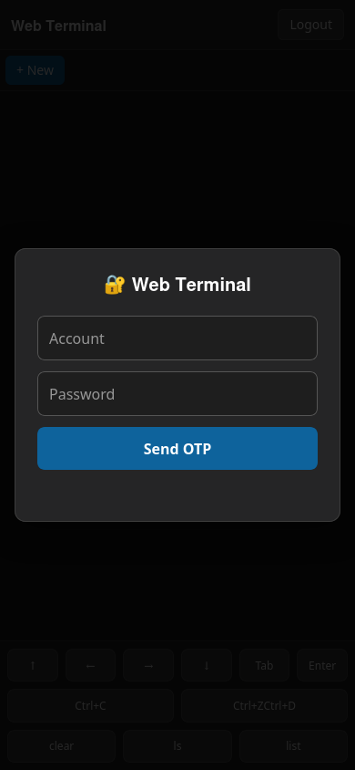
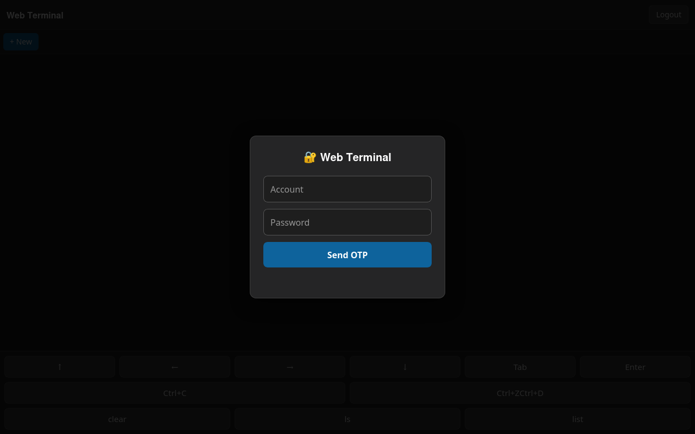

# Web Terminal

A phone-friendly web-based terminal inspired by [ttyd](https://github.com/tsl0922/ttyd).

- Multi-tab Ubuntu `/bin/bash` sessions in the browser
- Telegram-bot 6-digit OTP login
- Server-wide read-only mode (like `ttyd -r`)
- Phone control bar: arrow keys, Ctrl+C/Z/D, Tab, Enter, quick commands
- Runs in a background `tmux` session with UFW port auto-open

## Screenshots

Phone viewport



Desktop viewport



## Quick start

```bash
cd /home/himwong/Desktop/terninal-on-web

# 1. Configure
cp .env.example .env
cp .conf.example .conf
# Edit .env (PORT, Telegram bot token/chat ID, READ_ONLY)
# Edit .conf (accounts and passwords)

# 2. Run in tmux with UFW
./init.sh

# 3. Open URL on your phone/desktop browser
```

## Manual run (without tmux)

```bash
python3 -m venv .venv
source .venv/bin/activate
pip install -r requirements.txt
python3 server.py
```

For read-only mode:

```bash
python3 server.py --read-only
```

## Configuration

### `.env`

```dotenv
PORT=8765
TELEGRAM_BOT_TOKEN=YOUR_BOT_TOKEN
TELEGRAM_CHAT_ID=YOUR_CHAT_ID
READ_ONLY=false
```

### `.conf`

```json
{
  "accounts": [
    {"username": "admin", "password": "change-me"},
    {"username": "guest", "password": "guest"}
  ]
}
```

## init.sh commands

```bash
./init.sh              # start / restart server in tmux + open UFW port
./init.sh 8080         # start on port 8080 (overrides .env)
./init.sh start 8080   # same as above
./init.sh stop         # kill tmux session
./init.sh attach       # attach to tmux session
./init.sh status       # show status
```

## Telegram bot setup

1. Message [@BotFather](https://t.me/BotFather) on Telegram and create a bot.
2. Copy the bot token into `.env` as `TELEGRAM_BOT_TOKEN`.
3. Send any message to your bot, then visit `https://api.telegram.org/bot<TOKEN>/getUpdates` to find your chat ID.
4. Put the chat ID into `.env` as `TELEGRAM_CHAT_ID`.

> If the bot is not configured, the OTP is printed to the server console as a fallback (not recommended for production).

## Read-only mode

Set `READ_ONLY=true` in `.env` or run `python3 server.py --read-only`. In this mode the terminal output is visible but all keyboard input and control buttons are ignored server-side.

## Security notes

- Passwords in `.conf` are stored in plain text — only use this on trusted networks.
- No HTTPS is included. Put the service behind nginx or a reverse proxy for remote/production use.
- Each browser tab starts a fresh `/bin/bash` process.

## Project structure

```
.
├── server.py          # aiohttp server + PTY + auth
├── init.sh            # tmux + UFW launcher
├── requirements.txt
├── .env.example
├── .conf.example
├── README.md
└── static/
    ├── index.html
    ├── app.js
    └── style.css
```
